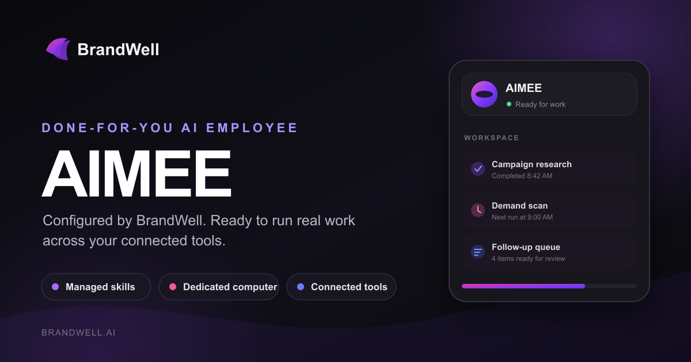

# BrandWell's AIMEE

[](https://github.com/ChainAI-Org/brandwell-aimee/stargazers)



AIMEE is BrandWell's platform for running persistent AI employees. It is available on the web,
as an Electron desktop app, and through an Expo mobile app. Bring your own model and computer
provider, or run the complete stack locally.

The managed BrandWell service connects clients, Sidekicks, models, computers, skills, and billing
through one control plane. Learn more at [brandwell.ai](https://brandwell.ai).

## Features

- Persistent bots with their own conversations, memory, routines, and history
- Voice mode: speak replies, dictate, and call a bot. Bring your own ElevenLabs, OpenAI, or Cartesia key
- Shared Team Computers and isolated Private computers
- Browser, terminal, file, and graphical desktop access
- Bots that can delegate to peer bots or short-lived subagents
- Bring-your-own model credentials through Pi
- App integrations through Composio or Pipedream Connect, plus user-installed Treg, remote MCP, and OpenAPI tool sources
- Docker, E2B, Daytona, Box, and trusted local-computer support

## Stack

- TypeScript
- React 19, Vite, and Tailwind CSS
- Electron and Expo
- Hono and oRPC
- PostgreSQL and Prisma
- Better Auth
- Graphile Worker
- Pi
- Docker, E2B, Daytona, and Box
- Composio, Pipedream Connect, MCP, and OpenAPI integrations

## Quick start

You need Node.js 22+, pnpm 9, and Docker Desktop.

```bash
git clone https://github.com/ChainAI-Org/brandwell-aimee.git
cd brandwell-aimee
cp .env.example .env
```

Set `BETTER_AUTH_SECRET` and `ENCRYPTION_KEY` in `.env` to independent, long random values. You can
also set `OPENROUTER_API_KEY`, or connect a supported model provider during onboarding.

Managed app catalogs are optional. Set `COMPOSIO_API_KEY` for Composio, or the
`PIPEDREAM_CLIENT_ID`, `PIPEDREAM_CLIENT_SECRET`, and `PIPEDREAM_PROJECT_ID` trio for Pipedream
Connect. Users can add an HTTPS MCP server, Treg endpoint, or OpenAPI JSON document from
**Integrations** without enabling either managed catalog. Connector credentials are encrypted on the
server and are never returned by the API.

Treg is usage-metered. Self-hosters supply their own Treg token; operators embedding Treg in a
hosted product should review [Treg's integration terms](https://treg.to/integrate.md), which require
a written agreement for hosted resale.

```bash
docker compose --env-file .env -f infra/compose/docker-compose.yml up postgres -d
pnpm install
pnpm db:generate
pnpm db:migrate
pnpm sandbox:build
pnpm dev
```

Open [http://127.0.0.1:5173](http://127.0.0.1:5173), create an account, connect a model, and create
your first bot.

For an agent-assisted installation, use [SETUP_PROMPT.md](./SETUP_PROMPT.md). For deployment,
provider selection, backups, and upgrades, see the [self-hosting guide](./docs/self-host.md).

## Desktop and mobile

The Electron and Expo apps are clients of the same AIMEE API used by the web app.

With the development stack running, launch Electron with:

```bash
pnpm --filter @brandwell/desktop dev
```

Installed BrandWell desktop builds open `https://ai.brandwell.ai` directly. They do not expose a
server chooser, including through environment overrides. Unpackaged development builds retain the
localhost and custom-server flow and honor the legacy `RAKAZO_WEB_URL` and `RAKAZO_FORCE_SETUP`
compatibility variables.

Mobile build and release instructions live in [docs/mobile-release.md](./docs/mobile-release.md).
BrandWell operators should also use the dedicated [AIMEE deployment runbook](./docs/brandwell-deployment.md)
and [AIMEE mobile release runbook](./docs/brandwell-mobile-release.md).

## Web UI language

The web (and Electron-hosted) UI supports English, Deutsch, and 한국어. Change it under
**Settings → Language**. The marketing homepage (`apps/www`) is available in en/de/ko via
footer language links (`/`, `/de/`, `/ko/`); other marketing pages stay English.

## Development

AIMEE is a TypeScript monorepo built with React, Electron, Expo, Hono, Postgres, Prisma, Graphile
Worker, and Pi.

```text
apps/       web, api, worker, desktop, mobile, and public website
packages/   domain, contracts, persistence, adapters, UI, and test tooling
infra/      local services and computer images
docs/       architecture, operations, and release guides
```

Common checks:

```bash
pnpm lint
pnpm check
pnpm test
pnpm test:integration
pnpm test:e2e
```

See [CONTRIBUTING.md](./CONTRIBUTING.md) for the development workflow and test matrix.

## Documentation

```bash
pnpm test              # unit, property, and in-process contract tests
pnpm test:integration  # Postgres journeys, Graphile jobs, LISTEN/NOTIFY
pnpm test:e2e          # Playwright against the emulated stack
pnpm test:e2e -- --sandbox=e2b # the same deterministic suite against real E2B
pnpm test:e2e -- --sandbox=daytona # the same suite against real Daytona
pnpm test:e2e -- --sandbox=box # the same suite against real Box
pnpm test:topology     # local Docker + Graphile worker recovery (needs Docker)
pnpm test:canary       # live OpenRouter / E2B / Box canaries
# explicit real vision-model + real E2B desktop acceptance test:
COMPUTER_E2E_MODEL=<vision-capable-openrouter-model-id> pnpm test:computer
```

- [Self-hosting](./docs/self-host.md)
- [Computer runtime and isolation](./docs/computer-runtime.md)
- [Mobile releases](./docs/mobile-release.md)
- [BrandWell AIMEE deployment](./docs/brandwell-deployment.md)
- [BrandWell AIMEE mobile releases](./docs/brandwell-mobile-release.md)
- [Performance testing](./docs/performance.md)

## Contributing

The Playwright workflow can also be started manually with **Sandbox provider** set to `e2b`, `daytona`, or `box`.
Those options require `E2B_API_KEY`, `DAYTONA_API_KEY`, or `BOX_API_KEY`, keep the deterministic scripted agent runtime, and destroy
the provider machines after the run. The default and all automatic runs remain on `fake`.
Contributions are welcome. Please read [CONTRIBUTING.md](./CONTRIBUTING.md) before opening a pull
request. For security vulnerabilities, follow [SECURITY.md](./SECURITY.md) instead of filing a public
issue.

AIMEE is licensed under the [Apache License 2.0](./LICENSE).
